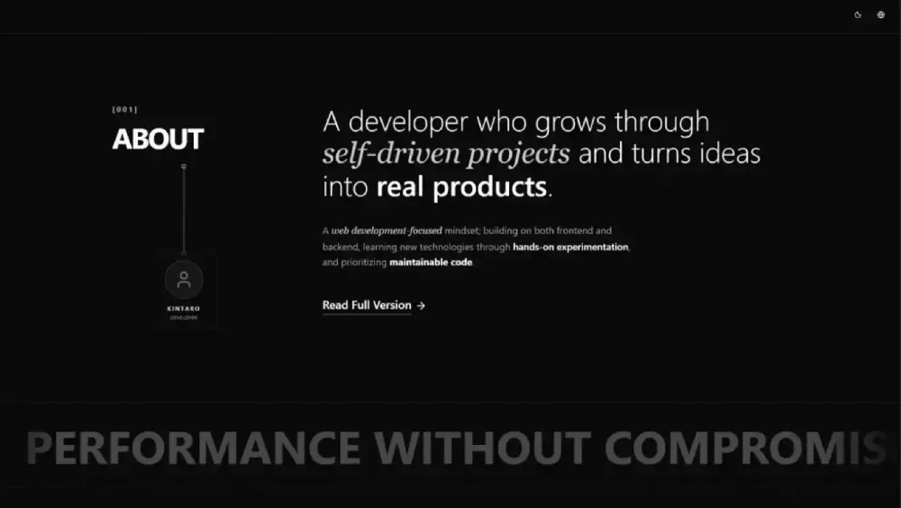

  

  

<b align="center" style="font-size: 16;">Always building, always learning. | Full Stack Developer</b>

  
  
  

<fieldset style="border: 2px solid #786B9C; border-radius: 10px; padding: 20px; max-width: 800px;">

  <legend align="left"><h3>👩🏻‍💻 About me</h3></legend>

  <em>
    I’m <strong>Kintaro</strong>, a self-taught <strong>Full Stack Developer</strong> passionate about building <strong>web applications</strong>, backend systems, and developer tools. I enjoy turning ideas into <strong>real products</strong>, constantly learning new technologies, and creating projects that combine <strong>functionality, scalability,</strong> and thoughtful design.
  </em>

   
  
</fieldset>

 

<fieldset style="border: 2px solid #786B9C; border-radius: 10px; padding: 20px; max-width: 800px;">

  <h3>⭐ My Favorites & Most Used</h3>

  
<i>My go-to technologies that I absolutely love working with.</i>

  

   

</fieldset>

 

<fieldset style="border: 2px solid #786B9C; border-radius: 10px; padding: 20px; max-width: 800px;">

  <h3>🏆 Featured Projects</h3>

  
<i>Some of my featured projects that I'm proud of.</i>

  <table align="center" style="background-color: transparent; max-width: 800px;">
    <tr>
      <td align="center" width="33%">
        
       <b>Kintarowwwards</b>
      </td>
      <td align="center" width="33%">
        
        <b>Aether Media</b>
      </td>
      <td align="center" width="33%">
        
        <b>Aether JS</b>
      </td>
    </tr>
  </table>
  
   
  
</fieldset>

 
 

   

