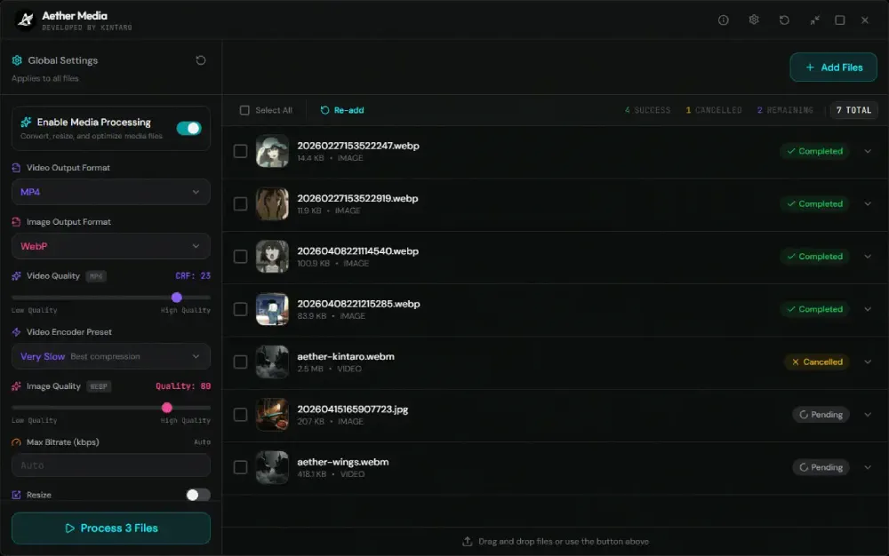
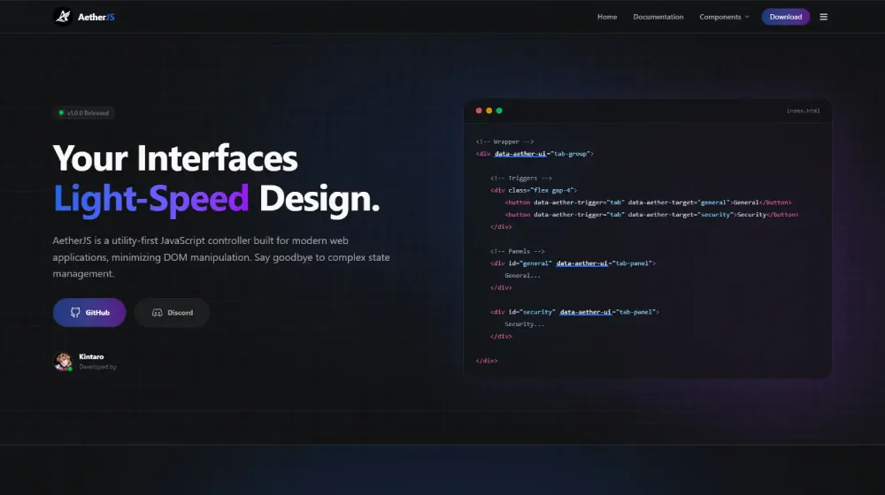

<b align="center">Always building, always learning. | Full Stack Developer</b>

 

  
  
  

#

  <h3>👩🏻‍💻 About me</h3>

  <em>
    I’m <strong>Kintaro</strong>, a self-taught <strong>Full Stack Developer</strong> passionate about building <strong>web applications</strong>, backend systems, and developer tools. I enjoy turning ideas into <strong>real products</strong>, constantly learning new technologies, and creating projects that combine <strong>functionality, scalability,</strong> and thoughtful design.
  </em>
  
   

#

  <h3>⭐ My Favorites & Most Used</h3>

  
<i>My go-to technologies that I absolutely love working with.</i>

  

 

#

  <h3>🏆 Featured Projects</h3>

  
<i>Some of my featured projects that I'm proud of.</i>

  <table align="center">
    <tr>
      <td align="center" width="33%">
        
       <b>Kintarowwwards</b>
      </td>
      <td align="center" width="33%">
        
        <b>Aether Media</b>
      </td>
      <td align="center" width="33%">
        
        <b>Aether JS</b>
      </td>
    </tr>
  </table>
    
   

 
 

   

